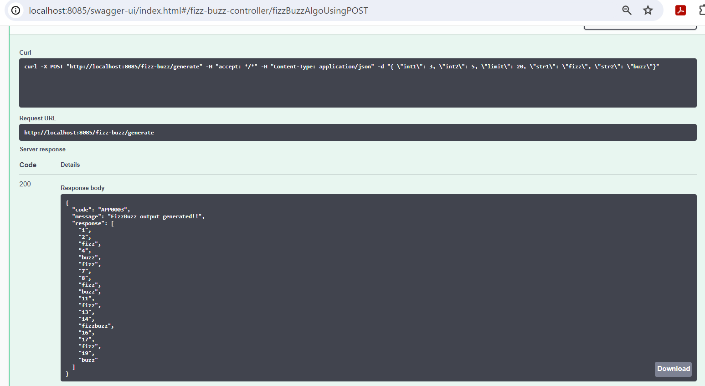
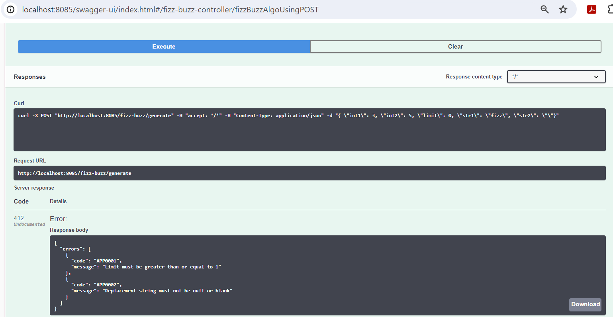
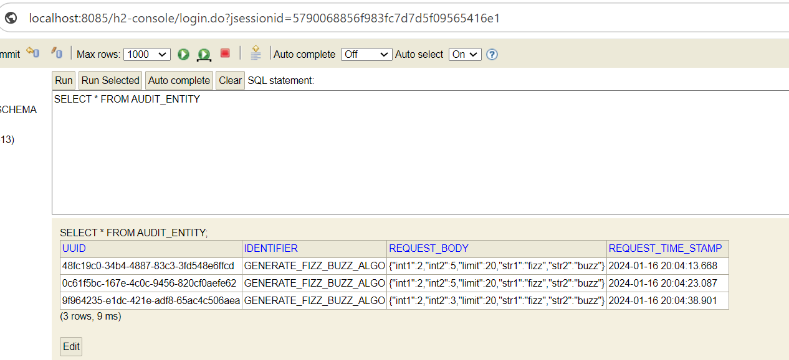
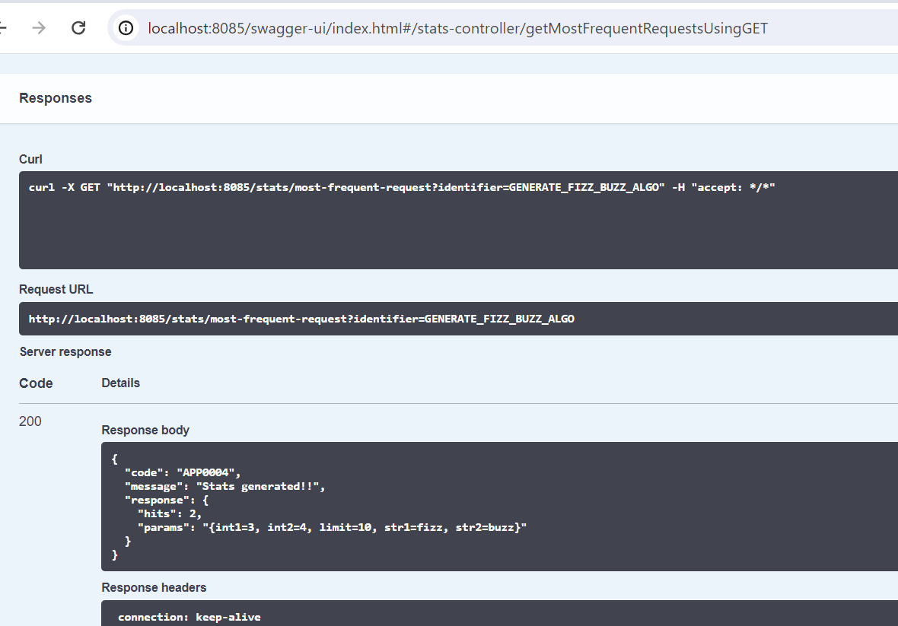

# FizzBuzzRESTServer
A rest server to test fizz buzz logic

<strong>Technologies/3rd party libraries used:</strong>
1) Language: Java
2) Frameworks/Libraries: 
    * <u>spring-boot-starter-web</u> - to build RESTful applications
    * <u>spring-boot-starter-validation, validation-api</u> - to validate Java beans/entities, ex: payload in POST/PUT request
    * <u>springfox-boot-starter, springfox-swagger-ui</u> - to generate API docs and display in UI in a pretty format
    * <u>spring-boot-starter-data-jpa</u> - uses JPA to store data in relational database
    * <u>h2</u> - to configure embedded, in-memory database, used to store requests audit in the project
    * <u>lombok</u> - to build getters, setters, builder in models at compilation time
    * <u>spring-boot-starter-aop</u> - to enable aspectj, used to intercept methods in controllers and audit requests
3) Containerization: <u>Docker</u> - to build image and run containers on the go without worrying about configurations

<strong>API Documentation</strong>
[Swagger Doc](http://localhost:8085/swagger-ui/index.html)

<strong>How to build and deploy</strong>
Below are the steps to build and deploy the project:
1) Ensure that docker is installed on your machine
2) Either build the docker image on your machine by <strong>navigation to project root folder</strong> and run below command:

    ```docker build -t fizz-buzz:latest .```

3) Run the container with the image tag and exposing 8085 port

   ```docker run -d -p 8085:8085 --name rochep1 fizz-buzz:latest```
4) Check logs of the container, if needed to check if spring-boot app is perfectly deployed

    ```docker logs <<container_id>>```

<strong>How to validate?</strong>
To access swagger, navigate to [swagger](http://localhost:8085/swagger-ui/index.html). This is the swagger ui for all api exposed as REST services

<strong>Input:</strong>
1) REST API Endpoint
   Accept five parameters: three integers (int1, int2, and limit) and two strings (str1 and str2).
   Return a list of strings containing numbers from 1 to limit.
   Replace multiples of int1 with str1, multiples of int2 with str2, and multiples of both int1 and int2 with str1str2

   * <strong>Steps:</strong>
      Navigate to Swagger UI -> FizzBuzzController -> provide valid input to /fizz-buzz/generate api. Invalid input will be caught and handled by <strong>ApiExceptionHandler</strong>  
   
   * <strong>curl command:</strong> ```curl -X POST "http://localhost:8085/fizz-buzz/generate" -H "accept: */*" -H "Content-Type: application/json" -d "{ \"int1\": 3, \"int2\": 5, \"limit\": 20, \"str1\": \"fizz\", \"str2\": \"buzz\"}"```  
   * <strong>UseCases:</strong>  
   <u>UseCase1: Valid input</u>
   
   <u>UseCase2: Invalid input(Replacement string is empty, limit is less than 1)</u>
   
   * <strong>Database Output</strong>  
   

2) Statistics Endpoint:
   Add a statistics endpoint that accepts no parameters.
   Return the parameters corresponding to the most used request.
   Include the number of hits for the most frequent request.

   * <strong>Steps:</strong>
     Navigate to Swagger UI -> StatsController -> hit /stats/most-frequent-request api and default identifier .
   * <strong>curl command:</strong>```curl -X GET "http://localhost:8085/stats/most-frequent-request" -H "accept: */*"```
   * <strong>UseCases:</strong>
   

<strong>Main Components:</strong>
1) <u>AuditAspect:</u> Responsible for intercepting controller methods and auditing basic information in H2 database.
It is a generic aspect class whose advice is run when any method in a controller is annotated with <strong>@Audit(identifier=identifier_name)</strong>.
```
@Audit(identifier = Identifier.GENERATE_FIZZ_BUZZ_ALGO)
@PostMapping("generate")
public ResponseEntity fizzBuzzAlgo(@RequestBody @Valid FizzBuzzRequestDTO request) {
   //code
}
```
The advice will log metadata like timestamp, unique id, identifier and request body. As of now <strong>GENERATE_FIZZ_BUZZ_ALGO</strong> is default identifier and is provided as annotation params in Controller method. This helps parse request body in @RequestBody annotation in a generic way and save in Audit database.
```
@Around("@annotation(com.roche.annotation.Audit)")
 public Object audit(ProceedingJoinPoint joinPoint) throws Throwable {
     MethodSignature methodSignature = (MethodSignature) joinPoint.getSignature();
     Annotation[][] annotationMatrix = methodSignature.getMethod().getParameterAnnotations();
     Object body = getRequestBody(joinPoint, annotationMatrix);

     String uuid = UUID.randomUUID().toString();
     Date currentTimeStamp = new Date();
     Identifier identifier = methodSignature.getMethod().getAnnotation(Audit.class).identifier();
     String payload = null;
     if(Objects.nonNull(body)) {
         payload = objectMapper.writeValueAsString(body);
     }

     AuditEntity entity = AuditEntity.builder()
         .uuid(uuid)
         .requestTimeStamp(currentTimeStamp)
         .identifier(identifier.name())
         .requestBody(payload)
         .build();

     auditRepository.save(entity);

     return joinPoint.proceed();
 }
```
Identifier is used to compare and provide stats of a request in StatsController in a generic way like number of top served request, top hits etc.
```
@GetMapping("most-frequent-request")
 public ResponseEntity getMostFrequentRequests(
     @RequestParam(required = false, defaultValue = "GENERATE_FIZZ_BUZZ_ALGO") String identifier)
 {
     List<AuditEntity> requests = auditRepository.findByIdentifier(identifier);
     
     //code
 }
```
2) <u>Embedded database:</u> Audit info is saved in Embedded H2 database and connection properties are present in application.properties
```
   spring:
      datasource:
         url: jdbc:h2:mem:demo
         driverClassName: org.h2.Driver
         username: roche
         password:
      jpa:
         database-platform: org.hibernate.dialect.H2Dialect
      h2:
         console:
         enabled: true
         settings:
            web-allow-others: true
```
3) <u>Exception Handling:</u> Custom exception handling for any kind of errors. See <strong>ApiExceptionHandler.java</strong>